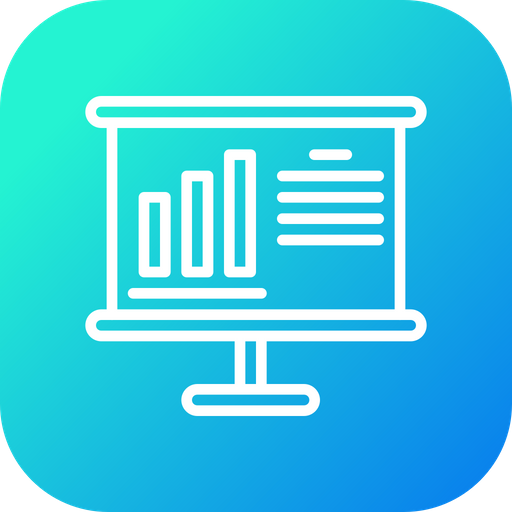

<h1 align="center">

  DoStuff
   
</h1>

<h4 align="center">
A Kanban type Project Division Application which includes a messaging application, Alert center for alerting Latest Task allotted. Includes time tracking with the due date setting etc.Front end using Angular, Database using MySql and used PHP REST API to interface with the database and front end.
</h4>

 
 
  
## Key Features

* A Kanban Project Division
* Messaging Application
* Alert center
* User Customization 
* Time tracking ( due date tracking )
* Project Space
* Members Show

## Login
The Login can be done by  using the email of the user after registration.

## Dashboard

The Dashboard Provide Customized User View of the Projects Started,Pending,Completed. Also shows the user Number and also the Project User is invloved in.

## Profile

The profile shows the user about the task which are due,assigned and closed. and the total number of the tasks. here the user is shown the list of task which has been assigned to the user.
user can modify Description,Comments,Priority and Assign the task to the next person.

## Spaces

the information about the projects are shown here and the status are assigned, Not Started,In Progress,On Hold, Completed this also shows the description about the project and important dates of the project.the projects are seprated on the basis of thier status this is kanban type project managment.
from here user can create a new project and add list to the project and also add the task to a specifc list and assign the task to each user.as in users profile the task is shown when the task is completed the status of the task is changed by the assisgnee.

## Members

the total number of members and thier details are shown here.

## Projects

when Clicked on the project from space the full description of the project sare shown along with the percent of the project completed. from here a project can be managed . the list of a specific project and all the task in the list is also shown here. from here user can also create and manage lists and tasks.

## Alert Center

The Alert Center is used to alert the user about the task that is pending ( that crossed the due date).
along with the task name and description about the task.

## Messaging

Message Center is used by the user to chat with the other members of the same organisation.withour using a additional messaging app user cam communicate the members. since there is no need to switch to anther app the users focus is conserved in the task.

## Built With

* [Angular](https://angular.io/start) - The web framework used
* [MySQL](https://firebase.google.com/) - Database Management
* [HTML & CSS](https://www.w3schools.com/html/html_css.asp) - Front End Development
* [PHP](https://firebase.google.com/) - Api

## Contributing

Anyone interested in contributing to the project , please give a pull request.

## License

This project is licensed under the MIT License 

